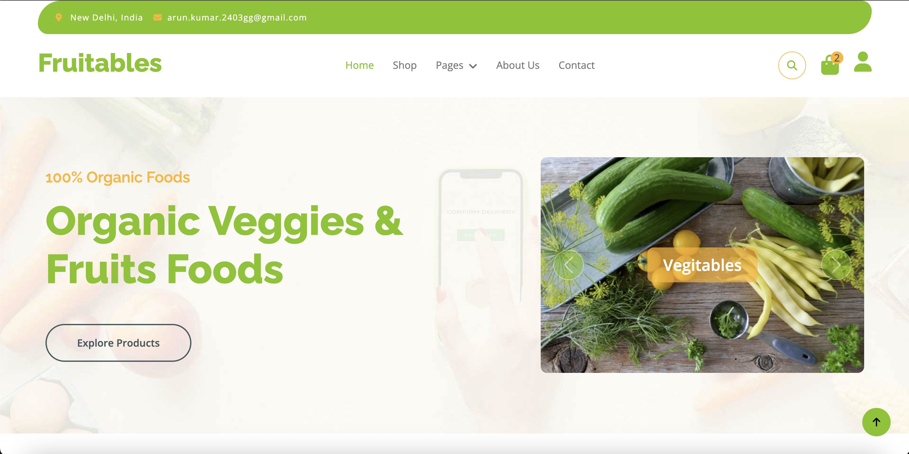
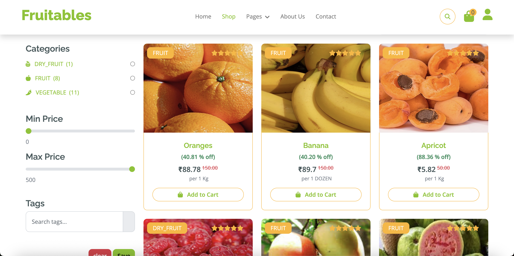
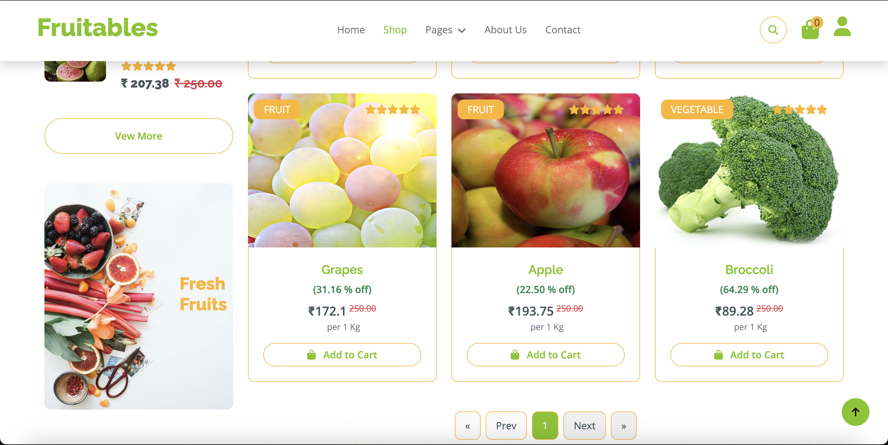
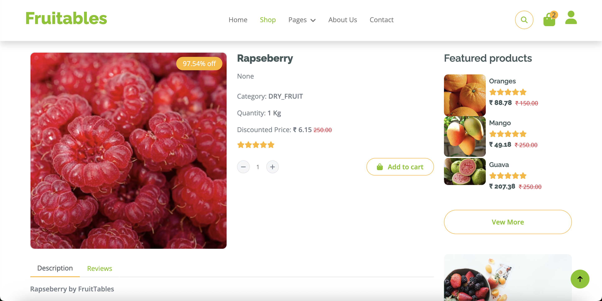
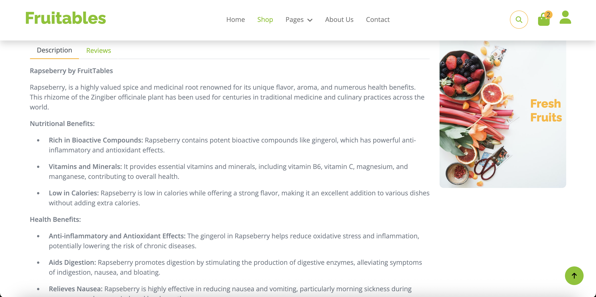
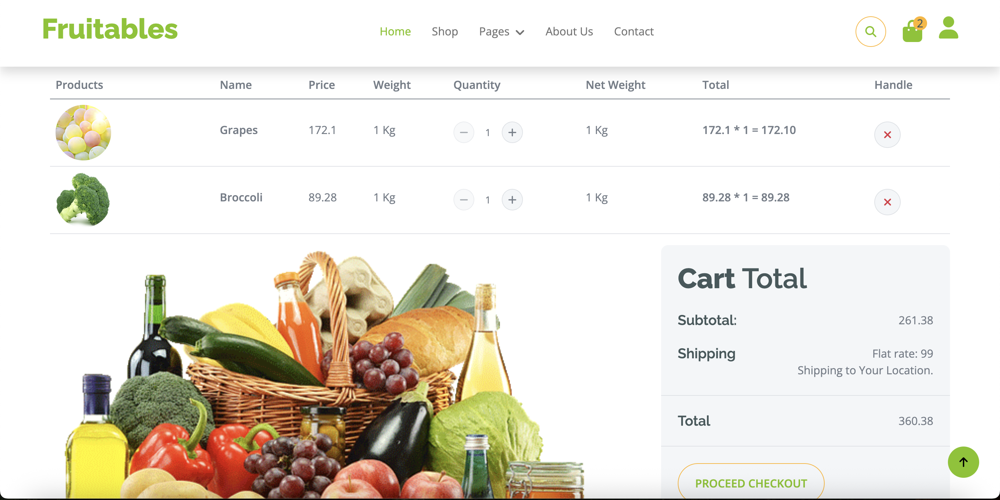
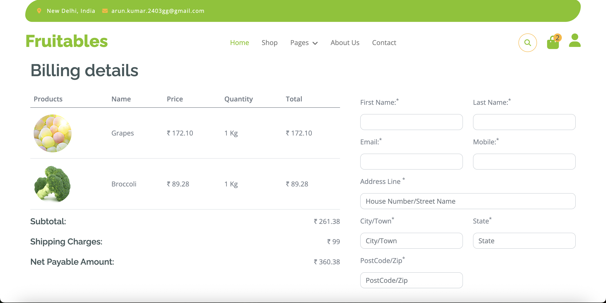

# Fruits Seller E-commerce Platform



## Overview

Fruits Seller is a full-featured e-commerce platform for selling fresh fruits online. Built with Django and Django REST Framework, it provides a seamless shopping experience with modern UI, robust backend, and secure payment integration.

---

## Features

- **User Authentication & Profiles**: Secure registration, login, and profile management for both customers and admins.
- **Product Catalog**: Browse, search, and filter a wide range of fruit products with detailed descriptions and images.
- **Cart Management**: Add, update, or remove products from the shopping cart. Cart persists for both authenticated and guest users.
- **Order Placement & Checkout**: Streamlined checkout process with address management and order summary.
- **Payment Integration**: Support for Cash on Delivery (COD).
- **Admin Dashboard**: Manage products, orders, users, and testimonials from a dedicated admin interface.
- **Responsive Design**: Mobile-friendly and modern UI using Bootstrap.
- **Pagination & Reviews**: Paginated product listings and customer reviews for products.
- **Contact & Testimonials**: Contact form and customer testimonials for trust-building.
- **Cloud Storage**: Static and media files are served via AWS S3 for scalability and performance.

---

### Home Page


### Product Listing



### Product Detail & Reviews



### Cart Page


### Checkout Page


---

## Technologies Used

- **Backend**:
  - Python 3
  - Django 5
  - Django REST Framework
  - PostgreSQL
  - AWS S3 (django-storages, boto3)
  - django-crispy-forms
  - django-filter
  - django-ckeditor-5
  - python-decouple

- **Frontend**:
  - HTML5, CSS3, JavaScript (ES6)
  - Bootstrap 5

---

## Project Structure

```
src/
  authentication/   # User auth and profile
  common/           # Common utilities and middleware
  contact/          # Contact form and logic
  core/             # Project settings and configuration
  main/             # Main site views
  orders/           # Order, cart, and checkout logic
  products/         # Product catalog and reviews
  static/           # Static files (CSS, JS, images)
  templates/        # Django templates
  testimonials/     # Customer testimonials
  users/            # User models and logic
  media/            # Uploaded media files
```

---

## Getting Started

1. **Clone the repository**
   ```powershell
   git clone <repo-url>
   cd fruits-seller
   ```
2. **Install dependencies**
   ```powershell
   pip install -r requirements.txt
   ```
3. **Configure environment variables**
   - Copy `.env.example` to `.env` and fill in your secrets (DB, AWS, Razorpay, etc.)
4. **Apply migrations**
   ```powershell
   python src/manage.py migrate
   ```
5. **Collect static files**
   ```powershell
   python src/manage.py collectstatic
   ```
6. **Run the development server**
   ```powershell
   python src/manage.py runserver
   ```

---
